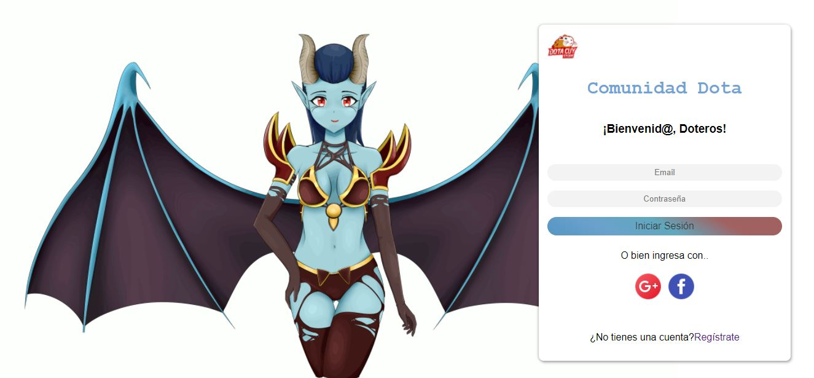
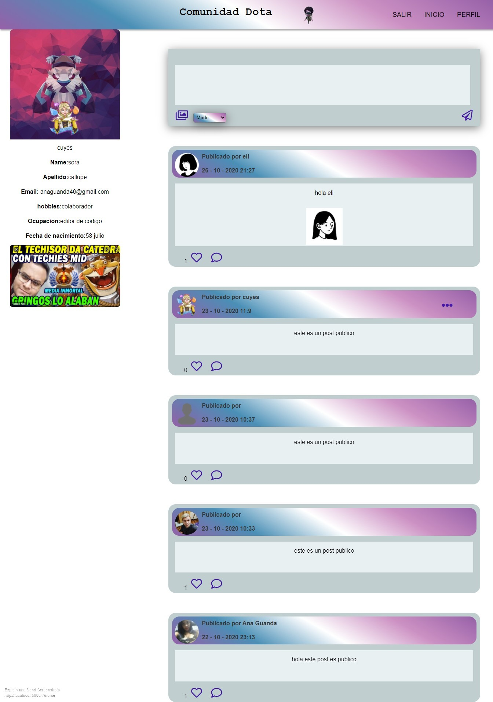
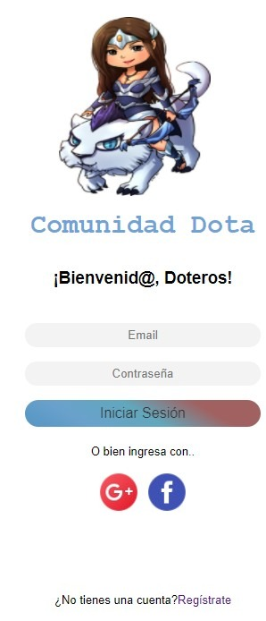
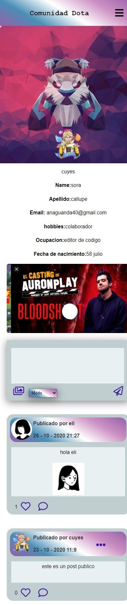

# Creando una Red Social
  

  

Bienvenidos a Comunidad Dota...

* [1. Resumen del proyecto](#1-resumen-del-proyecto)
* [2. Definición del producto](#2-definición-del-producto)
* [4. Objetivo](#4-Objetivo)

## 1. Resumen del proyecto

El objetivo de este proyecto es construir una Red Social, Single-Page Application (SPA), responsiva en la que podamos escribir, leer, actualizar y eliminar datos.

## 3. Definición del producto

Dota cuy es una red social destinada a la comidad Dota. Esta plataforma iteractiva permitirá a nuestro target usuario registarse con su correo electrónico o por su cuenta de gmail. La cual, luego les permitira iniciar sesión despues de ser registrado. Los suarios de Dota cuy podrán compartir conocimientos, estrategias, y consejos átravez de publicaciones, las cuales podrán ser publicas o privadas. Dota cuy, tambien les permitirá compartir imagenes. Los usuarios de la aplicación web, podrán editar, borrar y configurar la privacidad de su publicación

## 4. Objetivo

### Planificación

#### Arquitectura de la aplicación

A continuación te proporcionamos el layout (diseño) de la vista mobile y desktop.

- Vista Desktop

  
  
- Vista dos Desktop 

  

- Vista Mobile

  

- Vista dos Mobile 

  

### Múltiples vistas

En proyectos anteriores nuestras aplicaciones habían estado compuestas de una
sola _vista_ principal (una sóla _página_). En este proyecto se introduce la
necesidad de tener que dividir nuestra interfaz en varias _vistas_ o _páginas_
y ofrecer una manera de navegar entre ellas.

### Escritura de datos

En los proyectos anteriores hemos consumido (leído) datos, pero todavía no
habíamos escrito datos (salvar cambios, crear datos, borrar, ...). En este
proyecto tendrás que crear (salvar) nuevos datos, así como leer, actualizar y
modificar datos existentes. Estos datos se podrán guardar de forma remota
usando [Firestore](https://firebase.google.com/docs/firestore) o de forma
local utilizando`localStorage`.

### Historias de usuario

Para este proyecto vamos a entregarte las Historias de  Usuario para tú junto a tu equipo
puedan escribir los criterios de aceptación y definición determinado de cada una. Recuerda 
priorizar la implementación de tus funcionalidades, en función al esfuerzo que demandan en
relación al valor que le aportan al usuario, y ejecutar en equipo todas las historias de
usuario dentro del tiempo estimado para cada sprint y que finalmente se vean reflejadas 
en publicaciones completamentamente funcionales al final de cada sprint.

* Como usuario nuevo debo poder crear una cuenta con email y password válidos para ingresar
a la red social.

* Como usuario registrado debo poder iniciar sesión con email y password válidos para ingresar
a la red social.

* Como usuario nuevo debo poder iniciar sesión con mi cuenta de Google o Facebook para ingresar a la red social (sin necesidad de crear una cuenta de email válido).

* Como usuario loggeado debo poder crear, guardar, modificar en el mismo lugar (in place) y eliminar una publicación (post) privada o pública, que puede ser una frase o una imagen.

* Como usuario loggeado debo poder ver todos los posts públicos y privados que he creado hasta ese momento, desde el más reciente hasta el más antiguo, así como la opción de poder cambiar la configuración de privacidad de mis posts para poder elegir la privacidad de mis publicaciones.

* Yo como usuario loggeado, puedo dar like y llevar un conteo de likes en las publicaciones para poder indicar que me gusta una publicación.

* Yo como usuario loggeado debo poder escribir, guardar, editar o eliminar un comentario en una publicación para poder compartir mi opinión o hacer preguntas.

* Yo como usuario loggeado debo poder visualizar los datos de mi perfil creado y editarlos para actualizar mi información.

   > Como usuario registrado debo poder iniciar sesión con email y password válidos para ingresar
   > a la red social.
   >
   > **Criterios de Aceptación:** todo lo que debe ocurrir para satisfacer las
   > necesidades del usuario.
   > - Si el mail o password no es válido, al momento de logearme, debo poder 
   >   ver un mensaje de error.
   > - Debe ser visible si hay algún mensaje de error.
   > - Debo poder ver esta página de creación en Móviles y desktop (responsive). 
   > - No debe necesitar recargar la página para crear una cuenta (SPA).
   >
   > **Definición de terminado:** todos los aspectos técnicos que deben cumplirse
   > para que, como equipo, sepan que esa historia está terminada y lista
   > para publicarse. **Todas** tus Historias de Usuario (salvo excepciones), deben
   > incluir estos aspectos en su Definición de Terminado (más todo lo que
   > necesiten agregar):
   > - La funcionalidad cumple y satisface los criterios de aceptación.
   > - La funcionalidad tiene _test unitarios_.
   > - El diseño visual corresponde al prototipo propuesto.
   > - El código de esta funcionalidad recibió code review de una o dos compañeras 
   > de otro equipo.
   > - La funcionalidad esta desplegada y pública para ser probada. 
   > - La funcionalidad fue probada manualmente buscando errores e imperfecciones simples..
   > - La página es responsive (mobile first)
   > - Se hicieron pruebas de usuabilidad y se implementó el feedback si se 
   >   consideró necesario.

